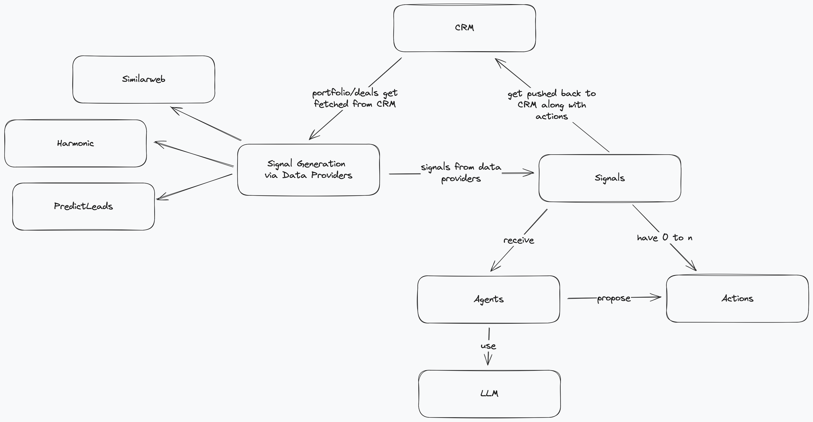

Data-Driven Hackathon

# Midas AI: VC Executive Assistant - Team 8


> This project was built as part of the Data-Driven VC Hackathon organized by [Red River West](https://redriverwest.com) & [Bivwak! by BNP Paribas](https://bivwak.bnpparibas/)

We belive agentic behavior will take Venture Capital into the AI era.
To support VCs in their day-to-day work, we created an agentic framework
that provides the basis for agentic behavior in daily operations.

Features:

- automated monitoring of portfolio companies (or targets) in any funnel
- fully integrated into the CRM
- automatic monitoring of the ecosystem
- agentic creation of signals/alerts with proposed course of action

Sources for Signals:

- 🧑‍🧑‍🧒‍🧒 headcount monitoring via Harmonic
- 📂 open positions monitoring based on PredictLeads
- 📊 reporting analysis based on OpenAI
- ⚔ competitor monitoring based on similarweb
- 💬 tracking of mentions around the web

## Architecture
This repo is built with layered/onion architecture.
The domain module defines all domain objects.
On top of this we have services.
Services can create signals, i.e. monitor a specific company.
They also react on signals and propose course of action (agents).
Finally, the signals with the agentic actions get pushed back into the CRM.



## Installation and Usage
Set up the environment file:
```
ATTIO_ACCESS_TOKEN=
ATTIO_COLLECTION=
OPENAI_API_KEY=
SIMILARWEB_API_KEY=
HARMONIC_API_KEY=
PREDICTLEADS_API_KEY=
PREDICTLEADS_API_TOKEN=
```

The app is fully dockerized, you follow the steps above and then run:
```
docker compose build
docker compose up
```

Alternatively you can create a virtual environment:
```
python3 -m venv venv
source venv/bin/activate
pip install -r requirements.txt
```

To run it locally, create the virtual environment and then run:
```
python -m app.cli
```
